# ABSTRICT database entity mapping

Nguồn suy luận: project Stitch `UI Screen Generator` (`8209048964041012099`) và các quy tắc đã chốt trong `PROJECT_IDEA.md`/`BACKEND_ARCHITECTURE.md`.

## Phạm vi screen

Mọi screen Landing Page dành cho desktop/mobile được loại trừ. Các screen ảnh, logo và file tham chiếu không biểu diễn form/luồng nghiệp vụ nên không sinh table.

| Screen nghiệp vụ | Entity chính | Dữ liệu UI được lưu |
| --- | --- | --- |
| Đăng ký Khách hàng - Form tối giản | `User`, `CustomerProfile` | họ tên, số điện thoại, mật khẩu đã băm, thời điểm chấp thuận điều khoản và chính sách quyền riêng tư |
| Xác thực mã OTP | `PhoneOtpChallenge`, `User` | HMAC OTP, mục đích, kênh SMS/Zalo ZNS, hạn dùng, thời điểm được gửi lại, số lần sai và thời điểm khóa challenge; xác thực thành công cập nhật `PhoneVerifiedAtUtc` |
| Đăng nhập Khách hàng - Form tối giản | `User`, `AuthSession`, `PhoneOtpChallenge` | đăng nhập bằng số điện thoại/mật khẩu hoặc OTP; phiên ghi nhớ chỉ lưu refresh-token hash, hạn dùng và thời điểm thu hồi |
| A1 - Khám phá dịch vụ | `Provider`, `FreelancerProfile`, `CompanyProfile`, `ProviderService`, `ServiceCategory`, `ProviderServiceArea`, `AvailabilityWindow`, `Rating`, `PromotionPurchase` | loại đối tác, hồ sơ, giá theo giờ, kỹ năng/dịch vụ, khu vực, lịch rảnh, điểm đánh giá, nhãn tài trợ |
| A2 - Chi tiết hồ sơ & Chọn lịch | `Provider`, `ProviderService`, `AvailabilityWindow`, `CustomerAddress`, `Booking`, `Rating` | hồ sơ chi tiết, bảng giá, slot rảnh, địa chỉ căn hộ, thời gian và giá tạm tính |
| A3-A4 - Tạo booking & Ký quỹ | `Booking`, `BookingTask`, `ChecklistTemplate`, `ChecklistTemplateItem`, `Payment` | snapshot thời gian/địa chỉ/giá, checklist đã chốt, ghi chú, cọc và phương thức thanh toán |
| A5 - Chi tiết đơn & QR | `BookingStatusHistory`, `BookingTask`, `BookingPhoto`, `CheckInToken`, `BookingExtension`, `Payment`, `Dispute` | timeline, tiến độ checklist, ảnh trước/sau, QR một lần, đề nghị gia hạn, nghiệm thu/quyết toán/khiếu nại |
| F1 - KYC Freelancer | `FreelancerProfile`, `VerificationDocument`, `BankAccount`, `ProviderService`, `ProviderServiceArea` | định danh, địa chỉ, OCR/face match, giấy sức khỏe/lý lịch tư pháp, kỹ năng, tài khoản nhận tiền |
| F4 - Quản lý đơn Freelancer | `Booking`, `BookingTask`, `BookingStatusHistory`, `Payment`, `MoneyMovement` | deadline phản hồi, xác nhận/từ chối, lịch ca, checklist, giá/cọc và thu nhập dự kiến |
| C1 - Định danh Doanh nghiệp | `CompanyProfile`, `CompanyRepresentative`, `CompanyWorker`, `VerificationDocument`, `ProviderServiceArea` | pháp nhân, MST, người đại diện, CCCD, ĐKKD/bảo hiểm, quy mô nhân sự, khu vực nhận ca |
| B1-B2 - Dashboard & Mua gói Freelancer | `PromotionPlan`, `PromotionPurchase`, `ProviderMetricDaily`, `Payment` | gói 7/30 ngày cấu hình động, thời hạn, lượt hiển thị/mở hồ sơ/chuyển đổi, thanh toán |
| B2 Company - Mua gói Doanh nghiệp | `PromotionPlan`, `PromotionPurchase`, `ProviderMetricDaily`, `CompanyWorker`, `Payment` | gói theo audience doanh nghiệp, giới hạn nhân sự/bán kính, metric và phương thức quyết toán |
| Admin Portal - Multi-View Workspace | `ProviderApprovalReview`, `ProviderAssessment`, `ProviderWallet`, `MoneyMovement`, `DisputeMessage`, `DisputeDecision`, `AuditLog` và các entity nguồn | hàng chờ duyệt freelancer/B2B, kết quả test, ký quỹ đối tác, phân xử/trao đổi khiếu nại, chỉnh giá gói và nhật ký vận hành |

## Quyết định mô hình

- `Provider` là hồ sơ thống nhất để discovery/booking/promotion cùng tham chiếu. Chi tiết 1-1 nằm ở `FreelancerProfile` hoặc `CompanyProfile`.
- Khách hàng đăng ký bằng số điện thoại nên `User.Email` là tùy chọn. OTP được lưu bằng HMAC-SHA256 với khóa cấu hình, challenge hết hạn sau 5 phút, chờ 45 giây trước khi gửi lại và khóa sau 5 lần nhập sai; không lưu mã rõ. Nhà cung cấp SMS production được tích hợp qua `IPhoneOtpSender`.
- Giá, địa chỉ và checklist được snapshot vào `Booking`/`BookingTask`; thay đổi hồ sơ sau này không làm sai lịch sử đơn.
- `Payment` ghi giao dịch với cổng thanh toán. `MoneyMovement` ghi nghĩa vụ/biến động tiền; hai khái niệm không gộp.
- File nhạy cảm chỉ lưu `ObjectKey` và metadata trong `VerificationDocument`, `BookingPhoto`, `DisputeEvidence`; không lưu binary vào PostgreSQL.
- QR chỉ lưu hash, hạn dùng và lần redeem. Không lưu GPS vì hợp đồng nghiệp vụ quy định check-in bằng QR, không dựa vào GPS.
- Giá gói, hạn xác nhận và cách thu phần tiền còn lại không hard-code. Chúng nằm ở `PromotionPlan`, deadline trên `Booking` và trạng thái `Payment`.
- Dashboard Admin, action queue, cảnh báo trễ QR, tổng Escrow và số người dùng gói là projection/query từ các bảng nguồn; không tạo bảng lưu số liệu dashboard trùng lặp.
- `ProviderApprovalReview` lưu lịch sử quyết định duyệt, không ghi đè lịch sử khi `Provider.ApprovalStatus` thay đổi.
- `ProviderWallet` định danh ví thu nhập hoặc ví ký quỹ; số dư được tính từ các `MoneyMovement` đã post thay vì lưu một số dư có thể lệch ledger.
- `AuditLog` chỉ lưu metadata thay đổi; tuyệt đối không đưa token, mật khẩu, CCCD thô hoặc nội dung KYC vào before/after JSON.
- Số tiền VND dùng `long`; ID dùng UUID; thời điểm dùng UTC.

## ERD tổng quát

```mermaid
erDiagram
    USER ||--o| CUSTOMER_PROFILE : has
    USER ||--o{ CUSTOMER_ADDRESS : owns
    USER ||--o| FREELANCER_PROFILE : authenticates
    USER ||--o| COMPANY_PROFILE : operates
    USER ||--o{ NOTIFICATION : receives

    PROVIDER ||--o| FREELANCER_PROFILE : freelancer_detail
    PROVIDER ||--o| COMPANY_PROFILE : company_detail
    COMPANY_PROFILE ||--o| COMPANY_REPRESENTATIVE : represented_by
    COMPANY_PROFILE ||--o{ COMPANY_WORKER : employs
    PROVIDER ||--o{ VERIFICATION_DOCUMENT : submits
    PROVIDER ||--o{ BANK_ACCOUNT : settles_to
    PROVIDER ||--o{ PROVIDER_APPROVAL_REVIEW : reviewed_through
    PROVIDER ||--o{ PROVIDER_ASSESSMENT : assessed_by
    PROVIDER ||--o{ PROVIDER_WALLET : owns

    PROVIDER ||--o{ PROVIDER_SERVICE : offers
    SERVICE_CATEGORY ||--o{ PROVIDER_SERVICE : categorizes
    PROVIDER ||--o{ PROVIDER_SERVICE_AREA : covers
    SERVICE_AREA ||--o{ PROVIDER_SERVICE_AREA : included_in
    PROVIDER ||--o{ AVAILABILITY_WINDOW : publishes
    SERVICE_CATEGORY ||--o{ CHECKLIST_TEMPLATE : defines
    CHECKLIST_TEMPLATE ||--o{ CHECKLIST_TEMPLATE_ITEM : contains

    USER ||--o{ BOOKING : creates
    PROVIDER ||--o{ BOOKING : fulfills
    SERVICE_CATEGORY ||--o{ BOOKING : selected_service
    CUSTOMER_ADDRESS o|--o{ BOOKING : source_address
    BOOKING ||--o{ BOOKING_TASK : snapshots
    BOOKING ||--o{ BOOKING_STATUS_HISTORY : transitions
    BOOKING ||--o{ BOOKING_PHOTO : documents
    BOOKING ||--o{ CHECK_IN_TOKEN : authorizes
    BOOKING ||--o{ BOOKING_EXTENSION : extends
    BOOKING ||--o{ COMPANY_WORKER_ASSIGNMENT : assigns
    COMPANY_WORKER ||--o{ COMPANY_WORKER_ASSIGNMENT : performs

    BOOKING o|--o{ PAYMENT : charged_by
    PAYMENT ||--o{ MONEY_MOVEMENT : produces
    PROVIDER o|--o{ MONEY_MOVEMENT : benefits
    PROVIDER_WALLET o|--o{ MONEY_MOVEMENT : records

    PROMOTION_PLAN ||--o{ PROMOTION_PURCHASE : selected
    PROVIDER ||--o{ PROMOTION_PURCHASE : buys
    PAYMENT o|--o| PROMOTION_PURCHASE : activates
    PROVIDER ||--o{ PROVIDER_METRIC_DAILY : measured_by

    BOOKING ||--o{ RATING : reviewed_by_parties
    BOOKING ||--o{ DISPUTE : disputed_by
    DISPUTE ||--o{ DISPUTE_EVIDENCE : contains
    DISPUTE ||--o{ DISPUTE_DECISION : decided_with
    DISPUTE ||--o{ DISPUTE_MESSAGE : discussed_in
```

## Constraint cần bổ sung ở migration PostgreSQL

EF model đã có unique index, amount/range/rating checks. Migration production cần thêm exclusion constraint trên khoảng thời gian để chặn booking/hold trùng freelancer ở cấp database, đồng thời transaction phải khóa và kiểm tra lại slot. Công ty không công khai availability nên việc trùng lịch được kiểm tra theo `CompanyWorkerAssignment` sau khi công ty phân công người thực hiện.
