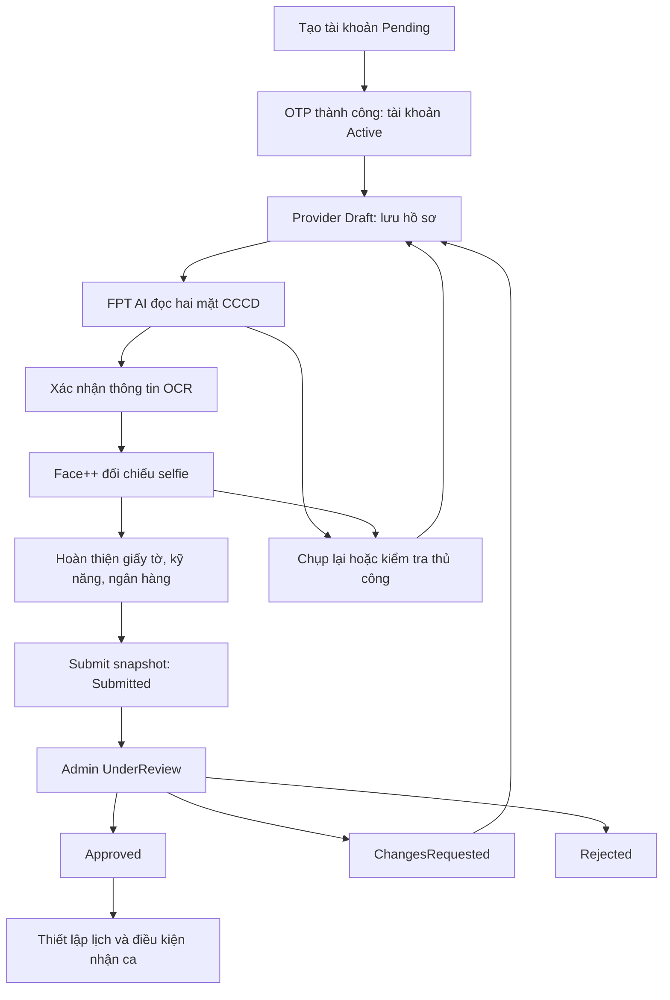

# Kế hoạch triển khai đăng ký freelancer — ABSTRICT

Ngày lập: 28/09/2026. Trạng thái: kế hoạch triển khai, chưa thay đổi API hoặc database.

## 1. Mục tiêu và phạm vi

Xây dựng luồng tạo tài khoản freelancer → xác thực điện thoại → hoàn thiện hồ sơ → đọc CCCD bằng FPT AI → đối chiếu ảnh chân dung CCCD với selfie bằng Face++ → gửi admin thẩm định → theo dõi kết quả và bổ sung hồ sơ.

Credential được cấu hình trong **app settings phía backend**. Frontend chỉ gọi ABSTRICT API, không giữ key và không gọi trực tiếp FPT AI/Face++.

Phạm vi gồm hợp đồng frontend/backend, trạng thái nghiệp vụ, database, tích hợp, cấu hình, kiểm thử và thứ tự triển khai. Booking, thanh toán, ký quỹ, mua gói, lịch làm việc và sát hạch kỹ năng là các module tiếp theo; không tự đưa thành điều kiện đăng ký nếu nghiệp vụ chưa chốt.

Các API, class và cấu hình ghi là “đề xuất” trong tài liệu này chưa tồn tại trong code. Chính sách lấy từ thiết kế nhưng chưa có trong `PROJECT_IDEA.md` được đánh dấu để chốt trước khi phát hành.

## 2. Căn cứ từ Stitch MCP và repository

### 2.1. Thiết kế đã truy cập

Đã gọi Stitch MCP `list_projects`, `list_screens`, `get_screen` và đọc HTML của màn hình F1:

- Project: [UI Screen Generator — ABSTRICT](https://stitch.withgoogle.com/projects/8209048964041012099).
- Project ID: `8209048964041012099`.
- Screen: **F1 - Đăng ký & Định danh KYC (Freelancer)**.
- Resource: `projects/8209048964041012099/screens/b8ab0645fd034de9a829b483893b3c43`.
- Màn hình OTP tham chiếu: `e1382efac0714f6f8160a45a0643cf69` — “Xác thực mã OTP - ABSTRICT”.
- F1 là desktop, metadata export 2560 × 5670. HTML thể hiện bốn nhóm hồ sơ, nút lưu nháp/gửi thẩm định và cột tóm tắt độ hoàn thiện.

| Nhóm trong F1 | Trường/thao tác thấy trong HTML | Cách triển khai |
| --- | --- | --- |
| 1. Thông tin cá nhân & khu vực nhận ca | Tên khai sinh, điện thoại đã OTP, ngày sinh, giới tính, địa chỉ thường trú/hiện tại, cụm căn hộ | Điện thoại lấy từ tài khoản; khu vực lấy từ danh mục backend; dữ liệu cá nhân được đối chiếu lại sau OCR |
| 2. CCCD & sinh trắc học | Hai mặt CCCD, xem/tải lại, số thẻ, hạn, ngày/nơi cấp, điểm Face Match | Upload riêng từng mặt; FPT AI đọc thông tin; Face++ so sánh chân dung với selfie |
| 3. Giấy tờ bổ sung | Giấy khám sức khỏe, lý lịch tư pháp số 2; PDF/PNG/JPG, mẫu ghi tối đa 15 MB | Upload private, nhập metadata, admin kiểm tra; yêu cầu bắt buộc và hạn giấy tờ là chính sách cần chốt |
| 4. Kỹ năng & thù lao | Chọn ít nhất một kỹ năng, ngân hàng, số tài khoản, tên chủ tài khoản theo OCR | Lưu danh mục dịch vụ và tài khoản nhận tiền; khóa tên theo danh tính đã xác nhận nhưng không coi là xác minh ngân hàng |
| Cuối trang/cột phụ | Cam kết, lưu nháp, gửi KYC, độ hoàn thiện, trạng thái từng nhóm | Tính từ dữ liệu server; hiển thị lỗi thiếu trường và bước cần sửa |

Giữ nhận diện màu tím `#6756D9`, font Plus Jakarta Sans, nền sáng, thẻ bo góc theo project. Desktop giữ stepper và cột tóm tắt; mobile chuyển một cột, CTA cuối màn hình không che input. Thiết kế đang là form dài: triển khai thành wizard bốn bước có lưu nháp, vẫn cho quay lại bước trước.

**Điều chỉnh nội dung mẫu khi hiện thực hóa:**

- “Ảnh trên chip CCCD” đổi thành “Ảnh chân dung trên CCCD”: phạm vi này không có đọc chip/NFC.
- “QR & MRZ hợp lệ”, “CCCD xác thực”, “sinh trắc cấp 2” chỉ được hiển thị khi có dịch vụ/bằng chứng tương ứng. OCR thành công chỉ cho phép ghi “Đã đọc thông tin”.
- `98.4%`, ngưỡng `85%`, độ hoàn thiện `92/100` là dữ liệu mẫu. Không hard-code, không diễn giải điểm tương đồng thành xác suất chắc chắn đúng danh tính.
- Chưa triển khai liên kết VNeID: chỉ nhận tệp người dùng tải lên. Không hứa phê duyệt trong 4 giờ, chi trả 30 phút, bảo hiểm hoặc thu nhập theo số liệu mẫu khi chưa có chính sách xác nhận.
- Bỏ nhãn chứng nhận ISO và “mã hóa đầu cuối AES-256” nếu chưa có căn cứ. Backend phải đọc dữ liệu để gửi OCR/so khớp nên không mô tả luồng này là mã hóa đầu cuối.
- Không biến các yêu cầu xét nghiệm trong mockup thành kiểm tra y tế tự động. Nội dung và tiêu chí giấy sức khỏe cần được nghiệp vụ xác nhận.

### 2.2. Hiện trạng backend

- ASP.NET Core 8, EF Core 8, PostgreSQL; kiến trúc định hướng Controller → Service → Repository trong `BACKEND_ARCHITECTURE.md`.
- `AuthController`, `CustomerRegistrationService`, `CustomerLoginService` hiện chỉ phục vụ khách hàng. Login kiểm tra `UserRole.Customer`; không thể dùng nguyên trạng cho freelancer.
- Có OTP hash, chống thử sai, cooldown, chuẩn hóa điện thoại và JWT. `OtpPurpose` chưa có đăng ký freelancer. Production chưa có SMS/Zalo sender thật.
- Có `User`, `Provider`, `FreelancerProfile`, `VerificationDocument`, `BankAccount`, `ProviderApprovalReview`, `ProviderAssessment`, `AuditLog`, `ProviderService`, `ProviderServiceArea`.
- `FreelancerProfile` có `FaceMatchScore` nhưng chưa có hồ sơ OCR chuẩn hóa, số CCCD, phiên KYC hoặc lịch sử từng lần so khớp.
- `VerificationDocument` có object key, metadata và `ExtractedDataJson`; chưa đủ quản lý phiên bản, job và kết quả nhà cung cấp.
- Unique index đã có trên điện thoại, `FreelancerProfile.UserId` và `ProviderId`. `User.Role` là một vai trò; chuyển tài khoản khách hàng sang freelancer chưa được định nghĩa.
- Chưa có endpoint freelancer, KYC client, private storage implementation hoặc quy trình admin duyệt.
- Các trường bắt buộc trong `FreelancerProfile` hiện không phù hợp tạo hồ sơ rỗng ngay khi đăng ký; cần vùng dữ liệu nháp riêng.

Nguồn nội bộ: `PROJECT_IDEA.md`, `BACKEND_ARCHITECTURE.md`, `docs/CUSTOMER_REGISTRATION_API.md`, `src/Abstrict.Api/Models/Entities`, `src/Abstrict.Api/Data/Configurations/AbstrictModelConfiguration.cs`, `src/Abstrict.Api/Program.cs`.

## 3. Luồng người dùng và điều kiện chuyển bước

### Bước 0 — Tạo tài khoản và OTP

1. Người dùng chọn đăng ký freelancer, nhập họ tên, điện thoại, mật khẩu/xác nhận, đồng ý điều khoản và chính sách riêng tư.
2. Backend chuẩn hóa điện thoại, kiểm tra trùng, hash mật khẩu; transaction tạo `User(Role=Freelancer, Status=Pending)`, `Provider(Type=Freelancer, ApprovalStatus=Draft, IsAcceptingBookings=false)` và hồ sơ nháp liên kết.
3. Tạo challenge mục đích `FreelancerRegistration`; gửi OTP qua `IPhoneOtpSender`. Áp dụng cùng chính sách hiện có: 6 chữ số, 5 phút, resend sau 45 giây, tối đa 5 lượt phát/ngày/số điện thoại, khóa challenge sau 5 lần sai.
4. OTP thành công chỉ kích hoạt **tài khoản** và đánh dấu điện thoại đã xác thực; provider vẫn Draft. Sau đó đăng nhập freelancer để nhận JWT và đi vào wizard.
5. Đăng nhập lại được phép tiếp tục hồ sơ Draft/Submitted/Rejected, nhưng không mở quyền nhận booking. Nếu JWT hết hạn trong wizard, đăng nhập lại rồi tải nháp từ server.
6. Challenge không dùng chéo giữa customer/freelancer. Một số điện thoại đã thuộc customer không được âm thầm đổi role; trả conflict và hướng dẫn hỗ trợ theo phạm vi MVP một role/tài khoản.

Tách tài khoản chưa OTP với provider chưa duyệt. Lỗi gửi SMS không để người dùng bị kẹt vĩnh viễn ở tài khoản pending: resend phải tạo lại challenge hợp lệ, có quota và không lộ thông tin nhạy cảm.

### Bước 1 — Thông tin cá nhân và khu vực

- Cho lưu dữ liệu một phần: tên pháp lý, ngày sinh, giới tính, thường trú, địa chỉ hiện tại, khu vực nhận ca; kinh nghiệm là trường tùy chọn đề xuất vì entity đã có.
- Điện thoại chỉ đọc; đổi điện thoại phải có quy trình OTP riêng, ngoài phạm vi này.
- Danh mục khu vực/dịch vụ lấy theo ID từ backend; không hard-code các dự án căn hộ trong mẫu. Server kiểm tra ID tồn tại và còn hoạt động.
- Validate ngày sinh không ở tương lai, độ dài chuỗi, kinh nghiệm không âm. Giới hạn tuổi hành nghề phải chốt theo chính sách, không tự suy ra từ mockup.
- Khi OCR khác dữ liệu tự khai: hiển thị so sánh và yêu cầu xác nhận. Không tự ghi đè âm thầm; sửa khác OCR phải có lý do và được admin xem xét.

### Bước 2 — CCCD, xác nhận OCR và khuôn mặt

1. Trước lần gửi ảnh đầu tiên, lấy đồng ý xử lý CCCD/sinh trắc và chuyển dữ liệu cho FPT AI/Face++; lưu phiên bản nội dung, thời điểm UTC và user ID.
2. Upload ảnh trước và sau theo hai document type riêng. Hướng dẫn đủ góc, rõ chữ, không lóa; cho xem lại và thay ảnh.
3. Backend validate, lưu private, tạo revision tài liệu. Chỉ người sở hữu được khởi tạo phiên OCR cho bộ ảnh đó.
4. Tạo job OCR, trả `202` và operation ID. UI hiển thị “Đang đọc CCCD”, polling với backoff; timeout không được hiển thị “CCCD không hợp lệ”.
5. Hiển thị thông tin nhận dạng: số CCCD che một phần, họ tên, ngày sinh, giới tính, thường trú, ngày/nơi cấp, ngày hết hạn nếu có. Người dùng đối chiếu và xác nhận snapshot OCR của revision hiện tại.
6. Trường không đọc được/độ tin cậy thấp: yêu cầu chụp lại hoặc gửi kiểm tra thủ công; không coi trường thiếu là hợp lệ. Nhận diện sai mặt, hai mặt không nhất quán, thẻ hết hạn được xử lý riêng.
7. Mở camera chụp selfie, xin quyền thiết bị, có hướng dẫn ánh sáng và nút chụp lại. Camera bị từ chối: hướng dẫn bật quyền hoặc tiếp tục bằng thiết bị khác. Không lấy ảnh avatar làm selfie mặc định.
8. Face++ kiểm tra số khuôn mặt và đối chiếu ảnh selfie với chân dung được lấy từ ảnh CCCD hiện tại. Backend quyết định `Matched`, `NotMatched`, `NeedsReview` hoặc `TechnicalError`.
9. Đổi ảnh trước/sau tạo revision mới, hủy hiệu lực xác nhận OCR và kết quả face match cũ. Đổi selfie chỉ hủy kết quả so khớp của selfie cũ. UI phải yêu cầu làm lại phần phụ thuộc.

**So khớp ảnh không chứng minh người thật đang hiện diện.** Phiên bản đầu lưu riêng `LivenessStatus=NotPerformed`, không ghi “đã kiểm tra người thật”. Nếu yêu cầu chống ảnh chụp lại/video giả trở thành điều kiện bắt buộc, cần thêm sản phẩm liveness được cấp quyền sử dụng và contract riêng; Face++ Compare không thay thế bước này. Admin vẫn duyệt hồ sơ, nhưng thao tác duyệt cũng không tự tạo bằng chứng liveness.

### Bước 3 — Giấy tờ bổ sung

- Cho upload giấy khám sức khỏe và lý lịch tư pháp, kèm ngày cấp, nơi cấp, ngày hết hạn nếu tài liệu có.
- PDF/JPG/PNG tối đa 15 MB/tệp là đề xuất bám F1; cấu hình độc lập với ảnh CCCD. PDF chỉ dùng cho tài liệu bổ sung, không gửi thẳng vào OCR CCCD.
- Tệp đi qua kiểm tra định dạng thực, giới hạn dung lượng và quét mã độc; chỉ dùng sau khi hoàn tất kiểm tra.
- Trạng thái upload thành công khác trạng thái admin xác minh. Không sử dụng FPT ID OCR để đọc giấy sức khỏe hoặc lý lịch tư pháp.
- Required/optional, loại phiếu được chấp nhận và thời hạn giấy tờ cần chốt trước production. API trả requirement theo policy version, FE không tự quyết định.

### Bước 4 — Kỹ năng, ngân hàng và gửi hồ sơ

- Chọn tối thiểu một dịch vụ, ít nhất một khu vực theo đề xuất F1. Đây là tự khai kỹ năng; không gắn nhãn “đã qua sát hạch” nếu chưa có assessment thật.
- Nhập ngân hàng và số tài khoản dạng chuỗi để giữ số 0 đầu. Tên chủ tài khoản suy ra từ danh tính đã xác nhận; cho báo sai để admin xử lý.
- Lưu số tài khoản mã hóa; GET chỉ trả dạng che. `BankAccount.IsVerified=false` cho tới khi có quy trình xác minh ngân hàng độc lập.
- Người dùng xem tổng hợp, lỗi thiếu thông tin và cam kết cuối. Lưu consent theo phiên bản, không nhận timestamp tự khai từ client.
- Submit kiểm tra server: điện thoại verified, đủ trường, tài liệu hiện hành hợp lệ, OCR đã xác nhận, kết quả face match đạt hoặc có nhánh manual review theo policy, đủ cam kết.
- Khi submit: đóng băng snapshot, tăng submission version, tạo `ProviderApprovalReview(Decision=Pending)`, chuyển `Provider.ApprovalStatus=Submitted` trong cùng transaction. Gửi lặp không tạo review thứ hai.
- Trang kết quả hiển thị “Đã gửi — chờ thẩm định”, mã hồ sơ, ngày gửi và bước tiếp theo. Không tự bật `IsAcceptingBookings`.

### Admin và hoàn tất

- Admin nhận hồ sơ: `Submitted → UnderReview`, xem snapshot, ảnh có quyền, khác biệt OCR/tự khai và lịch sử thử; mọi truy cập dữ liệu nhạy cảm có audit.
- `Approved`: tạo/cập nhật `FreelancerProfile` từ snapshot đã duyệt; duyệt tài liệu riêng có reviewer và thời điểm. Cho phép đi tiếp thiết lập lịch/giá, chưa tự bật nhận ca.
- `ChangesRequested`: lưu lý do theo trường/tài liệu, chuyển provider về `Draft`, mở phiên chỉnh sửa mới, giữ lịch sử snapshot cũ. Không cần thêm trạng thái vào `ApprovalStatus` hiện tại.
- `Rejected`: thông báo lý do phù hợp, không lộ thông tin tài khoản khác. Nếu chính sách cho đăng ký lại, hành động mở lại chuyển `Rejected → Draft` và tạo revision mới.
- Chỉ admin được duyệt, từ chối, yêu cầu bổ sung. Endpoint nghiệp vụ nhạy cảm phải đọc trạng thái DB hiện tại, không chỉ tin role/claim trong JWT cũ.

## 4. Trạng thái và tính nhất quán



Theo dõi riêng `AccountStatus`, `ApprovalStatus`, trạng thái từng document, trạng thái OCR, trạng thái face match và liveness. Không dồn tất cả vào `FaceMatchScore` hoặc một cờ `IsVerified`.

- Operation state đề xuất: `Queued / Processing / Succeeded / Failed / Superseded`.
- OCR state: `NotStarted / Processing / Extracted / NeedsReview / Failed`.
- Face state: `NotStarted / Processing / Matched / NotMatched / NeedsReview / TechnicalError`.
- Mỗi kết quả gắn `ApplicationVersion`, document revision, selfie revision, consent version, provider request ID và policy version.
- Worker chỉ ghi kết quả nếu revision vẫn hiện hành; kết quả cũ chuyển Superseded, không làm hồ sơ mới thành verified.
- PATCH dùng version/`If-Match`; version sai trả `409 STALE_APPLICATION_VERSION`. Submit và quyết định admin kiểm tra concurrency trong transaction.

## 5. Thiết kế dữ liệu đề xuất

### 5.1. Tận dụng entity hiện có

| Entity | Cách dùng/thay đổi |
| --- | --- |
| `User` | Giữ role Freelancer, phone verification, password hash và consent tài khoản |
| `Provider` | Tạo từ đầu ở Draft; display name tạm lấy tên đăng ký; `IsAcceptingBookings=false` |
| `FreelancerProfile` | Chỉ tạo khi duyệt từ dữ liệu đầy đủ; `FaceMatchScore` là bản chiếu kết quả hiện hành, không là nguồn quyết định duy nhất |
| `VerificationDocument` | Thêm revision, application ID, content hash, MIME, byte size, scan status, `SupersededAtUtc`; giữ file bằng object key |
| `BankAccount` | Tạo/cập nhật từ dữ liệu đã duyệt; số tài khoản mã hóa và IsVerified riêng |
| `ProviderApprovalReview` | Thêm application/submission version hoặc snapshot ID; mỗi lần gửi là một review |
| `ProviderService/ProviderServiceArea` | Ghi từ snapshot đã duyệt; nháp chưa đưa vào hồ sơ công khai |
| `AuditLog` | Ghi actor, hành động, resource, version, lý do; không ghi raw ảnh/CCCD/credential |

### 5.2. Entity mới

1. **`FreelancerApplication`**: `Id`, `UserId`, `ProviderId`, `Version`, `CurrentStep`, dữ liệu nháp nullable, danh sách service/area ID, ngân hàng được mã hóa, thời gian lưu/gửi. Unique UserId và ProviderId. Trường kiểu hóa cho phần truy vấn/validate; nếu dùng JSON cho nháp, có schema version và validate server.
2. **`IdentityVerificationAttempt`**: application/revision IDs, OCR state, face state, liveness state, thông tin CCCD chuẩn hóa được mã hóa, số CCCD HMAC để tra trùng, confidence từng trường, face score/threshold, result code, provider request IDs, policy version, các mốc UTC. Không dùng số CCCD plaintext làm index.
3. **`ApplicationSubmission`**: snapshot bất biến của nháp và bộ document revision tại thời điểm gửi; ràng buộc duy nhất application + version. Admin duyệt chính snapshot này.
4. **`KycConsent`**: user/application, loại consent, version nội dung, thời điểm chấp nhận hoặc rút lại. Rút consent ngăn các lần gửi provider tiếp theo và khởi tạo quy trình xử lý dữ liệu theo chính sách.
5. **`KycOperation`**: durable job và idempotency: owner, loại tác vụ, request hash, idempotency key, input revision, state, attempt count, lease expiry, next attempt, error code an toàn. Unique owner + loại tác vụ + idempotency key.

Quy tắc chống trùng CCCD: dùng HMAC với key độc lập và key version; không dùng SHA thuần vì miền số có thể dò. Cho phép tài khoản sửa OCR sai trong nháp. Khi submit reserve danh tính bằng bản ghi claim unique theo fingerprint trong transaction; release khi hồ sơ bị hủy/từ chối theo policy, giữ khi approved. Trùng chỉ trả lỗi chung và chuyển hỗ trợ; không lộ người sở hữu. Việc xoay key phải có kế hoạch reindex/dual lookup để không mất kiểm tra trùng.

Migration bổ sung bảng/cột và index, không sửa migration đã chạy. `OtpPurpose.FreelancerRegistration` được thêm mà giữ nguyên tên các giá trị cũ. Dữ liệu đang lưu enum dạng string. Kiểm tra migration trên database mới và database có customer; không ép dữ liệu freelancer cũ thành đã KYC.

## 6. API đề xuất

Base `/api/v1`. API customer hiện có giữ hợp đồng tương thích. Freelancer có routes riêng để tránh mở quyền nhầm.

| Method/path | Input chính | Kết quả/quyền |
| --- | --- | --- |
| `POST /auth/freelancers/register` | fullName, phoneNumber, password, confirmPassword, acceptTermsAndPrivacy | Public; `202`, challengeId, expiresAtUtc, resendAvailableAtUtc |
| `POST /auth/freelancers/verify-phone-otp` | challengeId, code | Public, challenge đúng purpose; `200`, verified |
| `POST /auth/freelancers/resend-phone-otp` | challengeId | Public có quota; `202`, challenge mới |
| `POST /auth/freelancers/login` | phoneNumber, password | `200`, JWT, role, onboarding status; chỉ user Active + phone verified |
| `GET /freelancers/me/onboarding` | — | JWT owner; nháp, version, trạng thái, requirements, missingFields |
| `PATCH /freelancers/me/onboarding` | Phần dữ liệu thay đổi; `If-Match` | JWT owner; save draft, trả version mới; không nhận trường quyết định KYC |
| `POST /freelancers/me/onboarding/consents` | loại + contentVersion + accepted | Ghi consent server timestamp |
| `POST /freelancers/me/onboarding/documents` | multipart type, file, metadata | `201`, documentId/revision, scan state; chống upload vào hồ sơ đã khóa |
| `GET /freelancers/me/onboarding/documents/{id}/content` | — | Kiểm tra owner; stream private hoặc URL ký ngắn hạn |
| `DELETE /freelancers/me/onboarding/documents/{id}` | version | `204`, bỏ tài liệu khỏi draft; invalidate kết quả phụ thuộc |
| `POST /freelancers/me/onboarding/identity/ocr` | frontDocumentId, backDocumentId, version | `202`, operationId; bắt buộc `Idempotency-Key` |
| `POST /freelancers/me/onboarding/identity/confirm` | attemptId, version, xác nhận/đính chính + lý do | `200`; xác nhận đúng revision, đính chính không thay raw OCR |
| `POST /freelancers/me/onboarding/identity/face-match` | selfieDocumentId, attemptId, version | `202`, operationId; backend tự chọn chân dung CCCD tương ứng |
| `GET /freelancers/me/onboarding/operations/{id}` | — | Owner; state, lỗi an toàn, nextPollAfterSeconds |
| `POST /freelancers/me/onboarding/submit` | version, finalConsentVersion | `202`, submissionId, Submitted; idempotent |
| `POST /freelancers/me/onboarding/reopen` | version | Rejected và policy cho phép; `200`, Draft mới |
| `GET /catalog/service-areas`, `GET /catalog/service-categories`, `GET /catalog/banks` | bộ lọc/phân trang | Danh mục cho form; ngân hàng có thể là danh mục cấu hình ban đầu |
| `GET /admin/freelancer-applications` | status, page, pageSize | Admin; danh sách không chứa toàn bộ CCCD |
| `GET /admin/freelancer-applications/{id}` | — | Admin; snapshot và metadata thẩm định |
| `GET /admin/freelancer-applications/{id}/documents/{documentId}/content` | — | Admin; kiểm tra tài liệu thuộc snapshot, audit truy cập |
| `POST /admin/freelancer-applications/{id}/start-review` | submissionVersion | Admin; khóa nhận xử lý bằng concurrency |
| `POST /admin/freelancer-applications/{id}/decision` | submissionVersion, decision, reason, requestedChanges | Admin; transaction cập nhật review/provider/profile |

Tất cả endpoint `/me` suy ra owner từ JWT; không tin userId/providerId do client gửi. Request DTO không có `ApprovalStatus`, `IsVerified`, `FaceMatchScore`, `Role`, threshold hoặc object key tùy ý. Key idempotency đã dùng với body khác trả `409 IDEMPOTENCY_KEY_REUSED`.

Response lỗi theo `ProblemDetails` hiện có: `code`, `traceId`, `errors` theo field nếu phù hợp. Phân biệt `400 VALIDATION_FAILED`, `401`, `403`, `409`, `413 FILE_TOO_LARGE`, `415 UNSUPPORTED_FILE_TYPE`, `422` lỗi ảnh/nghiệp vụ, `429` kèm Retry-After, `503` nhà cung cấp không sẵn sàng. Với job đã nhận `202`, lỗi sau đó được trả qua trạng thái operation, không giả lập HTTP thành công là KYC đạt.

Mã lỗi cần có: `PHONE_ALREADY_REGISTERED`, `DOCUMENT_SIDE_INVALID`, `OCR_INCOMPLETE`, `IDENTITY_CONFIRMATION_REQUIRED`, `IDENTITY_CONFLICT`, `ID_EXPIRED`, `NO_FACE_DETECTED`, `MULTIPLE_FACES_DETECTED`, `FACE_NOT_MATCHED`, `KYC_PROVIDER_UNAVAILABLE`, `APPLICATION_INCOMPLETE`, `APPLICATION_LOCKED`, `STALE_APPLICATION_VERSION`, `CONSENT_REQUIRED`.

## 7. Tích hợp FPT AI

Tạo `IFptAiIdentityClient` và `FptAiIdentityClient` bằng typed `HttpClient`. Adapter chỉ lo request/response; service KYC quyết định nghiệp vụ.

Theo tài liệu FPT Reader, dùng `POST https://api.fpt.ai/vision/idr/vnm/`, multipart `image`; mặt trước thêm `face=1`. Tutorial dùng header `api_key`, trong khi ví dụ API reference có `api-key`: cấu hình `ApiKeyHeaderName`, smoke-test với tài khoản thực để chốt. Ảnh không quá 5 MB, nên đủ 640×480 trở lên. [FPT API](https://docs.fpt.ai/docs/en/vision/api/id-recognition/), [FPT tutorial](https://docs.fpt.ai/docs/en/vision/tutorials/id-recognition/).

Pipeline triển khai:

1. Gọi riêng mỗi mặt, kiểm tra HTTP lẫn mã lỗi trong payload. Không mặc định `data[0]` luôn tồn tại; validate schema và loại mặt thẻ trước mapping.
2. Mapping về model nội bộ: document number, tên, ngày sinh, giới tính, thường trú, ngày/nơi cấp, hạn, loại giấy tờ, confidence từng trường. Tên field thực tế được khóa bằng fixture cho loại CCCD sử dụng; không phụ thuộc trực tiếp raw JSON ở frontend.
3. Chuẩn hóa ngày và Unicode; giữ số thẻ dạng chuỗi. Với loại thẻ không trả cùng trường ở hai mặt, chỉ đối chiếu trường có thật; không tự coi mặt sau có số CCCD. Kiểm tra hết hạn phải hỗ trợ giá trị không thời hạn theo schema provider.
4. Khi `face=1` trả URL chân dung, tải ngay về private storage: tài liệu nêu link hết hiệu lực sau 5 phút. Không để worker Face++ phụ thuộc URL tạm. [FPT tutorial](https://docs.fpt.ai/docs/en/vision/tutorials/id-recognition/).
5. Khi tải URL do provider trả về, chỉ cho HTTPS và host allowlist đã xác minh; chặn private IP, redirect sang host khác, giới hạn size/timeout. Không cho client truyền URL tùy ý để backend fetch.
6. Nếu thiếu crop hoặc tài khoản không có tính năng: báo trạng thái có thể khắc phục/manual review; không chọn ngẫu nhiên một khuôn mặt trên toàn ảnh CCCD.

OCR là trích xuất dữ liệu; không đồng nghĩa kiểm tra giấy tờ thật, đọc chip hoặc tra cứu cơ sở dữ liệu dân cư. FPT còn có dòng API khác: trước implementation cần xác nhận đúng gói Reader, loại CCCD/căn cước được hỗ trợ, response schema và quota của credential thực tế.

## 8. Tích hợp Face++

Face++ Compare là đối chiếu 1:1 và trả điểm cùng các threshold; chọn nó cho ảnh CCCD và selfie, không cần FaceSet/Search 1:N. [Face++ Face Comparing](https://www.faceplusplus.com/face-comparing/).

Tạo `IFaceVerificationClient`/`FacePlusPlusClient`. Contract dự kiến dùng `POST /facepp/v3/detect` và `POST /facepp/v3/compare`, credential `api_key`, `api_secret` và ảnh multipart (`image_file` hoặc `image_file1`/`image_file2` theo endpoint). Chốt lại field, giới hạn ảnh, region và quyền API bằng sandbox trước viết adapter chính thức: trang tài liệu chi tiết [Compare API](https://console.faceplusplus.com/documents/5679308) hiện chỉ trả trang loading khi đọc tự động, nên các chi tiết request này là contract dự kiến, chưa phải kết quả thử API.

1. Detect selfie: yêu cầu đúng một khuôn mặt; crop từ CCCD cũng phải dùng được. Không để Compare tự chọn khuôn mặt lớn nhất trong ảnh nhiều người.
2. Dùng hai ảnh từ storage server đã ràng buộc vào cùng application/revision. Không nhận điểm/face token tự khai từ frontend làm bằng chứng.
3. Lưu score, threshold thực dùng, request ID, policy version, thời điểm. Thiếu score/threshold cần thiết hoặc payload lỗi → TechnicalError/NeedsReview, không tự pass.
4. Ngưỡng lấy từ cấu hình và hiệu chỉnh bằng tập kiểm thử có đồng ý sử dụng; lưu cả ngưỡng theo response nếu contract hỗ trợ. `85` trong Stitch chỉ là tham khảo. Không chốt một ngưỡng production khi chưa đo false accept/false reject.
5. Dưới ngưỡng: hướng dẫn chụp lại có giới hạn; hết lượt chuyển hỗ trợ/admin. Không biến timeout/quota thành “không khớp”. Không công khai điểm thô nếu chỉ cần trạng thái người dùng.
6. Không lưu face embedding/token lâu dài nếu không cần; không tạo cơ sở dữ liệu tìm kiếm khuôn mặt trong phạm vi đăng ký.

## 9. App settings và credential

Đặt schema trong `src/Abstrict.Api/appsettings.json` bằng giá trị rỗng/placeholder; credential thật đặt ở `appsettings.Local.json` hoặc appsettings theo môi trường triển khai được cấp ngoài Git. `.gitignore` hiện đã bỏ qua `appsettings.Local.json`, nhưng `Program.cs` **chưa load file này**; implementation phải thêm rõ ràng.

Ví dụ cấu hình đề xuất, **không chứa credential thật**:

```json
{
  "Kyc": {
    "Enabled": false,
    "FptAi": {
      "BaseUrl": "https://api.fpt.ai/",
      "IdentityPath": "vision/idr/vnm/",
      "ApiKeyHeaderName": "api_key",
      "ApiKey": "",
      "TimeoutSeconds": 30
    },
    "FacePlusPlus": {
      "BaseUrl": "",
      "DetectPath": "facepp/v3/detect",
      "ComparePath": "facepp/v3/compare",
      "ApiKey": "",
      "ApiSecret": "",
      "TimeoutSeconds": 30,
      "MatchThreshold": null
    },
    "Upload": {
      "IdentityMaxBytes": 5000000,
      "SelfieMaxBytes": 5000000,
      "SupportingDocumentMaxBytes": 15000000
    },
    "Policy": {
      "Version": "draft-v1",
      "RequireHealthCertificate": true,
      "RequireCriminalRecord": true,
      "AllowManualReview": true,
      "MaxFaceAttemptsPerDay": 5,
      "LivenessMode": "NotImplemented"
    },
    "DataProtection": {
      "EncryptionKey": "",
      "EncryptionKeyVersion": "",
      "IdentityHmacKey": "",
      "RetentionDays": null
    },
    "Storage": {
      "Provider": "",
      "Endpoint": "",
      "Bucket": "",
      "AccessKey": "",
      "SecretKey": "",
      "SignedUrlTtlSeconds": 60
    }
  }
}
```

Các giá trị policy/dung lượng/timeout là đề xuất ban đầu; `true` cho hai giấy tờ bám F1 và phải chốt trước production. Region Face++, threshold và thời hạn lưu cố ý để trống: không bật `Kyc.Enabled` khi thiếu cấu hình bắt buộc.

Cách wiring:

1. Ngay sau `CreateBuilder`, load optional `appsettings.Local.json`, sau đó đăng ký lại environment variables và command-line để chúng vẫn có ưu tiên cao hơn file local. Không load local secret ở frontend hoặc copy vào bundle.
2. Bind `KycOptions`, `FptAiOptions`, `FacePlusPlusOptions`, storage/protection options; validate lúc startup khi Enabled. Kiểm tra HTTPS, key không rỗng, host/region, threshold theo miền giá trị contract, dung lượng và timeout dương.
3. Key mã hóa và HMAC CCCD độc lập với JWT key, OTP key và provider key; có version và quy trình rotate. Key mã hóa tồn tại bền vững qua restart/deploy.
4. Đăng ký typed HttpClient, service, repository, storage và worker qua DI. Không đưa credential vào URL query, response, exception, HTTP body log hoặc request tracing.
5. Credential trên máy chủ được cấp qua file appsettings có quyền đọc hạn chế/mount khi deploy; không bake vào Docker image. Có thể override cùng key bằng environment như `Kyc__FptAi__ApiKey` nếu môi trường cần.
6. OTP tiếp tục dùng `Otp:HmacKey` và sender riêng. FPT OCR/Face++ key không giải quyết việc gửi OTP; phải triển khai SMS/Zalo thật trước bật đăng ký production.

## 10. Xử lý nền, retry và dữ liệu nhạy cảm

- Dùng `KycOperation` làm durable queue cùng `BackgroundService`/worker trong dự án hiện tại; không cần thêm message broker ở bản đầu. Worker claim bằng lease/atomic update để nhiều instance không chạy trùng job.
- Không giữ DB transaction trong lúc gọi provider. Ghi job trước, gọi HTTP ngoài transaction, rồi cập nhật bằng revision/concurrency check.
- Timeout đề xuất 30 giây/lần; tối đa 2 retry cho lỗi transient khi phù hợp, exponential backoff + jitter, tôn trọng Retry-After. Không retry ảnh sai, authentication sai hoặc hết quota dài hạn.
- Crash sau provider response trước ghi DB có thể gây gọi lại và tính phí; local idempotency không tạo bảo đảm exactly-once ở provider. Dùng request ID để đối soát khi có hỗ trợ và giới hạn retry/cost.
- Rate limit theo IP, tài khoản, loại tác vụ; quota tổng cho provider và circuit breaker. Đếm lượt server-side kể cả người dùng thay idempotency key.
- Middleware rate limit hiện chạy trước authentication: khi bổ sung limit theo user cần sắp thứ tự để identity được resolve trước policy đó; kiểm thử cả IP limit public và user limit JWT.
- Private storage, HTTPS, mã hóa PII khi lưu; signed URL ngắn hạn hoặc stream có authorization. Không ghi ảnh/CCCD đầy đủ vào localStorage, analytics, error report hoặc log.
- Kiểm tra chữ ký file, decode ảnh, pixel limit để chống ảnh nén quá lớn; bỏ EXIF không cần thiết. Tên object sinh ngẫu nhiên, không lấy tên file người dùng làm đường dẫn.
- Cấu hình thời hạn giữ nháp, hồ sơ bị từ chối, ảnh gốc, crop, selfie và raw provider response trước production. Job dọn dữ liệu phải xét snapshot đang review, audit, retention và backup; không xóa file đang được thẩm định.
- Tránh giữ raw response nếu model chuẩn hóa đủ dùng; nếu cần lưu để điều tra thì mã hóa, hạn chế quyền và có hạn xóa.
- Metrics: tỷ lệ OCR lỗi, face không khớp/lỗi kỹ thuật, latency, retry, quota, backlog, thời gian duyệt và tỷ lệ bỏ dở. Label metrics không chứa điện thoại/CCCD.

## 11. Thứ tự triển khai và file dự kiến

| Giai đoạn | Công việc cụ thể | Điều kiện hoàn thành |
| --- | --- | --- |
| 1. Khóa contract | Xác nhận policy, FPT schema/header/crop, Face++ region/contract, storage và SMS; tạo fixtures đã ẩn danh | Chạy thử với credential môi trường test, thống nhất DTO và lỗi |
| 2. Nền dữ liệu | Application, attempt, submission, consent, operation, identity claim; EF mappings/migration | Migrate DB mới/cũ, bảo toàn customer và uniqueness |
| 3. Auth freelancer | Register/OTP/login; tái sử dụng helper an toàn, purpose riêng; JWT role đúng | Hoàn thành OTP, login, resume; customer tests vẫn pass |
| 4. Draft & upload | Save/resume, catalog, private storage, scan, document revision | Có thể tải/sửa nháp, không truy cập chéo tài khoản |
| 5. OCR | FPT client, normalize response, crop download, confirm/đính chính | Đúng mặt thẻ, thiếu field, lỗi provider và revision cũ đều được xử lý |
| 6. Face++ | Detect/compare, threshold policy, retry/quota, camera UX | Đúng/sai/nhiều mặt/lỗi kỹ thuật phân biệt; không pass khi thiếu kết quả |
| 7. Submit & admin | Snapshot, concurrency, quyết định/changes requested/reopen, audit | Không duyệt snapshot cũ hoặc gửi lặp tạo review trùng |
| 8. Frontend & phát hành | Wizard theo F1, mobile, state loading/error, E2E, cấu hình triển khai | Kiểm thử acceptance, bật feature flag theo môi trường |

Cấu trúc file đề xuất dưới `src/Abstrict.Api/`:

```text
Controllers/FreelancerAuthController.cs
Controllers/FreelancerOnboardingController.cs
Controllers/AdminFreelancerApplicationsController.cs
Controllers/CatalogController.cs
Services/Interfaces/IFreelancerRegistrationService.cs
Services/Interfaces/IFreelancerOnboardingService.cs
Services/Interfaces/IKycService.cs
Services/Interfaces/IProviderApprovalService.cs
Services/Implementations/                       # implementation tương ứng
Repositories/Interfaces/                       # application, KYC, review, user
Repositories/Implementations/                  # EF Core và transaction
Integrations/Identity/FptAiIdentityClient.cs
Integrations/Identity/FacePlusPlusClient.cs
Integrations/Identity/                          # interfaces, provider DTO, mapper
Integrations/Storage/                           # private storage interface/adapter
BackgroundJobs/KycOperationWorker.cs
BackgroundJobs/KycRetentionWorker.cs
Options/                                       # typed app settings
DTOs/Requests/                                 # request theo từng bước
DTOs/Responses/                                # onboarding, operation, submission
Models/Entities/                               # entity mới/bổ sung
Data/Configurations/AbstrictModelConfiguration.cs
Data/Migrations/                               # migration mới
Program.cs
appsettings.json
```

Service customer hiện đang dùng trực tiếp DbContext; module mới tuân thủ Repository theo tài liệu kiến trúc. Chỉ tách helper OTP/token/phone dùng chung ở mức cần thiết, không kèm refactor toàn bộ customer flow. Frontend triển khai tại repo React tương ứng, vì workspace hiện tại là backend.

## 12. Kế hoạch kiểm thử và tiêu chí nghiệm thu

### Kiểm thử tự động khi implementation

- Unit: mapping OCR nhiều loại response, ngày/Unicode/số 0 đầu, đánh giá threshold, state transition, required fields, invalidation và idempotency.
- Integration PostgreSQL thật/test container: race khi register cùng số, reserve cùng CCCD, hai lần submit, hai admin duyệt, update revision trong lúc worker chạy, crash/reclaim job, migrate DB có customer.
- HTTP contract bằng fake `HttpMessageHandler`: đúng headers/multipart; payload lỗi trong HTTP 200, missing field, timeout, 429, quota, 5xx, crop URL hết hạn; không gọi provider thật trong CI mặc định.
- Authorization: owner A không đọc/sửa ảnh hoặc job của B; freelancer không gọi admin; JWT hết hạn hoặc account Suspended bị chặn; client tự gửi status/score không làm thay đổi quyết định.
- Upload: MIME giả, file quá lớn, ảnh nhiều pixel, file độc hại, crop URL SSRF, URL ký hết hạn, xóa tài liệu sau submit bị chặn.
- E2E: happy path, resume sau logout, OTP sai/hết hạn/resend, camera bị từ chối, thiếu giấy tờ, OCR cần sửa, face mismatch, lỗi provider, changes requested và resubmit.
- Regression: chạy các test customer hiện có sau thay đổi auth/middleware; bổ sung test mới trong `tests/Abstrict.Api.Tests`, không thay test cũ bằng kiểm tra freelancer.

### Điều kiện nghiệm thu

1. Freelancer mới tạo tài khoản/OTP/login và tiếp tục nháp trên thiết bị khác được.
2. OCR FPT AI đọc hai mặt, có xác nhận dữ liệu; ảnh mới luôn vô hiệu hóa kết quả phụ thuộc cũ.
3. Face++ nhận đúng hai ảnh của cùng bộ hồ sơ; chỉ backend quyết định kết quả, không pass khi lỗi kỹ thuật.
4. Credentials đọc từ app settings backend và không xuất hiện trong FE/log/Git; startup chặn cấu hình KYC thiếu khi Enabled.
5. Gửi thiếu dữ liệu bị chặn với lỗi theo trường; gửi đủ chỉ chuyển chờ duyệt, không được nhận booking.
6. Admin duyệt/yêu cầu bổ sung/từ chối đúng snapshot, có lịch sử; không mất tài liệu cũ đang review.
7. Hai người dùng không truy cập dữ liệu nhạy cảm của nhau; tài liệu không public; hạn lưu/xóa được cấu hình và kiểm tra.
8. UI không đưa ra tuyên bố đọc chip, liveness, xác thực ngân hàng hoặc chứng nhận ngoài khả năng đã triển khai.

## 13. Các quyết định cần chốt trước production

Không cản trở việc triển khai cấu trúc và mock integration; cần quyết định trước bật luồng thật:

- Giấy sức khỏe/lý lịch tư pháp có bắt buộc không, loại tài liệu và thời hạn chấp nhận; độ tuổi tối thiểu.
- Có bắt buộc liveness/chống giả mạo không; nếu có, chọn sản phẩm được cấp quyền và bổ sung flow trước phát hành.
- Ngưỡng Face++, ngưỡng confidence OCR từng trường, số lần thử và trường hợp được chuyển manual review.
- Loại thẻ CCCD/căn cước hỗ trợ, gói FPT AI và vùng Face++ theo credential thực tế; quota và giới hạn chi phí.
- Storage, thời hạn lưu từng loại dữ liệu, key management và quy trình xóa/khôi phục backup.
- Nhà cung cấp OTP production; SLA duyệt và thông báo trạng thái.
- Phạm vi tài khoản đa vai trò và chuyển customer → freelancer; kế hoạch hiện tại giữ một role như schema.
- Xác minh ngân hàng, bài kiểm tra kỹ năng và điều kiện bật nhận booking thuộc giai đoạn nào.

## 14. Nguồn tham chiếu

- [Stitch project ABSTRICT](https://stitch.withgoogle.com/projects/8209048964041012099), screen F1 resource ghi tại mục 2; đã truy cập qua Stitch MCP và đọc HTML export.
- [FPT AI — ID Recognition API](https://docs.fpt.ai/docs/en/vision/api/id-recognition/).
- [FPT AI — ID Recognition tutorial, face crop](https://docs.fpt.ai/docs/en/vision/tutorials/id-recognition/).
- [Face++ — Face Comparing](https://www.faceplusplus.com/face-comparing/).
- [Face++ — Compare API documentation](https://console.faceplusplus.com/documents/5679308), trang chi tiết cần xác minh thêm trong console vì nội dung không tải đầy đủ bằng công cụ đọc web.

Các tham số tích hợp cần được khóa lại bằng contract test với tài khoản test trước khi dùng production; tài liệu này không chứa kết quả gọi OCR/Compare trên CCCD thật.
