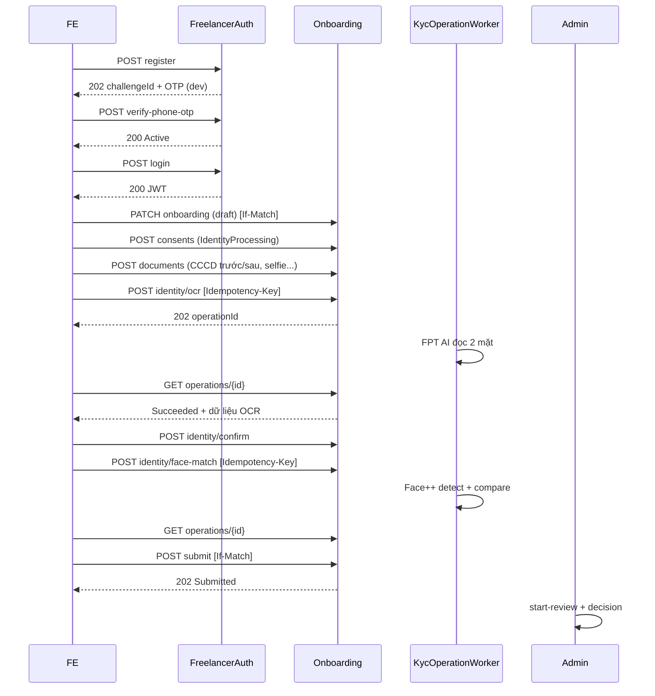

# Review triển khai luồng đăng ký Freelancer — ABSTRICT

Tài liệu này để đọc lại và nghiệm thu phần đã triển khai của
[`FREELANCER_REGISTRATION_PLAN.md`](./FREELANCER_REGISTRATION_PLAN.md).
Ngày soạn: 28/09/2026. Phạm vi: **backend** (`src/Abstrict.Api`) — frontend wizard F1 nằm ở repo React riêng.

Trạng thái: đã build sạch, 43/43 test pass, migration đã sinh nhưng **chưa chạy trên database**.

---

## 1. Tóm tắt đã làm được gì

Đã hiện thực trọn luồng backend:

1. **Đăng ký freelancer** → tạo `User(Freelancer, Pending)` + `Provider(Freelancer, Draft, IsAcceptingBookings=false)` + `FreelancerApplication` nháp, sinh OTP purpose riêng `FreelancerRegistration`.
2. **OTP + đăng nhập** → kích hoạt tài khoản, phát JWT role `Freelancer`, cho resume nháp.
3. **Wizard nháp** → GET/PATCH hồ sơ có version (`If-Match`), consent, upload tài liệu private có revision.
4. **OCR CCCD (FPT AI)** → tạo job `KycOperation`, xử lý nền, trả trạng thái operation để polling.
5. **Xác nhận dữ liệu OCR** → đính chính có lý do, không ghi đè raw OCR.
6. **So khớp khuôn mặt (Face++)** → detect 1 mặt + compare với ảnh CCCD, backend quyết định Matched/NotMatched/NeedsReview/TechnicalError.
7. **Submit** → kiểm tra đầy đủ, đóng băng snapshot, tạo `ApplicationSubmission` + `ProviderApprovalReview(Pending)`, reserve danh tính chống trùng CCCD.
8. **Admin thẩm định** → start-review, approve / changes-requested / reject đúng snapshot, có audit.
9. **Catalog** → service areas / categories / banks.

Điểm đáng chú ý: tài khoản chưa xác thực tách khỏi provider chưa duyệt; OCR/so khớp chỉ là trích xuất dữ liệu, **không** tự bật nhận booking; `LivenessState = NotPerformed`.

---

## 2. Sơ đồ luồng



Trạng thái lưu riêng biệt: `AccountStatus`, `Provider.ApprovalStatus`, `FreelancerApplication.Status`,
`OcrState`, `FaceState`, `LivenessState`, `DocumentScanStatus`, `KycOperationState` — không dồn vào một cờ.

---

## 3. API contract

Base `/api/v1`. Endpoint `/me` suy ra owner từ JWT, **không** tin `userId` client gửi.

### 3.1. Auth freelancer (public) — `FreelancerAuthController`

| Method/path | Input | Kết quả |
| --- | --- | --- |
| `POST /auth/freelancers/register` | fullName, phoneNumber, password, confirmPassword, acceptTermsAndPrivacy | `202` + challengeId, expiresAtUtc, resendAvailableAtUtc |
| `POST /auth/freelancers/verify-phone-otp` | challengeId, code | `200` Active |
| `POST /auth/freelancers/resend-phone-otp` | challengeId | `202` challenge mới / `404` |
| `POST /auth/freelancers/login` | phoneNumber, password | `200` JWT + onboardingStatus + currentStep / `401` |

Rate limit dùng lại policy hiện có: `auth-register` (5/10’), `auth-otp-verify` (10/1’), `auth-otp-resend` (3/10’), `auth-login` (10/1’).
OTP: 6 số, 5 phút, resend 45s, tối đa 5 lượt/24h/số, khóa sau 5 lần sai — tái dùng `OtpCodeHasher` + `OtpAttemptPolicy`.

### 3.2. Onboarding (JWT role `Freelancer`) — `FreelancerOnboardingController`

| Method/path | Ghi chú |
| --- | --- |
| `GET /freelancers/me/onboarding` | nháp + version + trạng thái + requirements + missingFields |
| `PATCH /freelancers/me/onboarding` | partial; `If-Match` version; tăng version |
| `POST /freelancers/me/onboarding/consents` | loại + contentVersion + accepted; timestamp server |
| `POST /freelancers/me/onboarding/documents` | multipart `file` + metadata; `201` documentId/revision |
| `GET /freelancers/me/onboarding/documents/{id}/content` | stream private, kiểm tra owner |
| `DELETE /freelancers/me/onboarding/documents/{id}` | `If-Match`; invalidate kết quả phụ thuộc |
| `POST /freelancers/me/onboarding/identity/ocr` | `Idempotency-Key` + `If-Match` → `202` operationId |
| `POST /freelancers/me/onboarding/identity/confirm` | attemptId + corrections + reason |
| `POST /freelancers/me/onboarding/identity/face-match` | selfieDocumentId, attemptId; `Idempotency-Key` |
| `GET /freelancers/me/onboarding/operations/{id}` | state + errorCode + nextPollAfterSeconds |
| `POST /freelancers/me/onboarding/submit` | `If-Match` + finalConsentVersion; `202` submissionId |
| `POST /freelancers/me/onboarding/reopen` | Rejected/ChangesRequested → Draft |

### 3.3. Admin (role `Admin`) — `AdminFreelancerApplicationsController`

`GET /admin/freelancer-applications?status&page&pageSize`,
`GET /admin/freelancer-applications/{id}`,
`GET .../{id}/documents/{documentId}/content` (ghi audit),
`POST .../{id}/start-review`, `POST .../{id}/decision`.

### 3.4. Catalog — `CatalogController`

`GET /catalog/service-areas?city`, `GET /catalog/service-categories`, `GET /catalog/banks`.

### 3.5. Mã lỗi đã dùng

`PHONE_ALREADY_REGISTERED`, `INVALID_FULL_NAME`, `INVALID_PHONE_NUMBER`, `PASSWORD_CONFIRMATION_MISMATCH`,
`TERMS_NOT_ACCEPTED`, `OTP_CHALLENGE_NOT_FOUND`, `OTP_ATTEMPTS_EXCEEDED`, `OTP_ALREADY_USED`, `OTP_EXPIRED`,
`INVALID_OTP`, `OTP_RESEND_COOLDOWN`, `OTP_SEND_LIMIT_EXCEEDED`, `OTP_DELIVERY_UNAVAILABLE`, `OTP_SECURITY_NOT_CONFIGURED`,
`FREELANCER_REGISTRATION_NOT_PENDING`, `APPLICATION_NOT_FOUND`, `APPLICATION_LOCKED`, `STALE_APPLICATION_VERSION`,
`APPLICATION_INCOMPLETE`, `CONSENT_REQUIRED`, `DOCUMENT_NOT_FOUND`, `DOCUMENT_SIDE_INVALID`, `IDEMPOTENCY_KEY_REUSED`,
`ATTEMPT_NOT_FOUND`, `OCR_INCOMPLETE`, `ID_EXPIRED`, `NO_FACE_DETECTED`, `MULTIPLE_FACES_DETECTED`, `FACE_NOT_MATCHED`,
`IDENTITY_CONFLICT`, `KYC_PROVIDER_UNAVAILABLE`, `KYC_SECURITY_NOT_CONFIGURED`, `FILE_TOO_LARGE`, `UNSUPPORTED_FILE_TYPE`,
`SUBMISSION_NOT_FOUND`.

Lỗi trả theo `ProblemDetails` với `code` + `traceId` (mở rộng `FlowProblemExtensions`), `429` kèm `Retry-After`.

---

## 4. Data model

### 4.1. Entity mới

| Entity | Vai trò | Ràng buộc chính |
| --- | --- | --- |
| `FreelancerApplication` | Dữ liệu nháp + version + status + step | unique `UserId`, unique `ProviderId`; check `experience_years >= 0` |
| `IdentityVerificationAttempt` | Phiên OCR/face theo revision, có `ApplicationVersion`, `SupersededAtUtc` | index `(ApplicationId, SupersededAtUtc)` |
| `ApplicationSubmission` | Snapshot bất biến mỗi lần submit + decision | unique `(ApplicationId, Version)` |
| `KycConsent` | Consent theo type + content version | index `(UserId, ConsentType, ContentVersion)` |
| `KycOperation` | Durable job + idempotency + lease | unique `(UserId, Type, IdempotencyKey)`; index claim |
| `IdentityClaim` | Chống trùng CCCD bằng fingerprint HMAC | unique `Fingerprint` |

### 4.2. `VerificationDocument` được bổ sung

Thêm `ApplicationId`, `Revision`, `ContentType`, `ContentHash`, `ByteSize`, `ScanStatus`, `SupersededAtUtc`.
Ảnh CCCD/selfie lưu private qua `ObjectKey` sinh ngẫu nhiên, không lộ tên file.

### 4.3. Bảo vệ dữ liệu nhạy cảm

- Số CCCD: `AES-GCM` (`SensitiveDataProtector`) + `HMAC-SHA256` fingerprint (`IdentityFingerprintService`) để tra trùng — không dùng plaintext làm index.
- Số tài khoản ngân hàng: mã hóa, GET chỉ trả `last4` che; `IsVerified = false` (chưa có luồng xác minh ngân hàng).
- `FaceMatchScore` chỉ là bản chiếu kết quả hiện hành, không phải nguồn quyết định duy nhất.
- Key mã hóa/HMAC là **key riêng** với JWT/OTP/provider, có `EncryptionKeyVersion`.

---

## 5. Tích hợp ngoài

- `IFptAiIdentityClient` / `FptAiIdentityClient`: `POST {BaseUrl}{IdentityPath}`, multipart `image`, mặt trước thêm `face=1`, header cấu hình qua `ApiKeyHeaderName`.
- `IFaceVerificationClient` / `FacePlusPlusClient`: `detect` (đúng 1 mặt) + `compare` (lấy `confidence` + `thresholds`).
- Mapping FPT bền với schema hay đổi: envelope linh hoạt + `FptAiResponseMapper` thử nhiều tên field, giữ số CCCD dạng chuỗi (không mất số 0 đầu), chuẩn hóa ngày/Unicode.
- Khi `Kyc:Enabled = false`: dùng `StubFptAiIdentityClient` / `StubFaceVerificationClient` để chạy được luồng ở local/test mà không gọi provider thật.
- `KycOptionsValidator` chặn startup nếu `Enabled = true` mà thiếu HTTPS/key/threshold/limit.

> Điểm lệch so với plan: URL crop chân dung (`face=1`) **chưa** được tải về private storage; worker so khớp selfie với **ảnh mặt trước CCCD** thay vì crop chân dung riêng. Khi có tài khoản FPT thật cần bổ sung bước tải crop (allowlist host, HTTPS, chặn SSRF).

---

## 6. Xử lý nền

`KycOperationWorker` (BackgroundService) trong dự án, không cần broker:

- Claim job bằng `SELECT ... FOR UPDATE SKIP LOCKED`, lease 5 phút → nhiều instance không chạy trùng.
- Không giữ DB transaction khi gọi provider: ghi job trước, gọi HTTP ngoài transaction, cập nhật bằng check revision.
- Lỗi transient (`KYC_PROVIDER_UNAVAILABLE`) retry tối đa 3 lần, backoff `2^n * 5s`. Job đã bị supersede → `Superseded`, không ghi đè kết quả mới.
- Kết quả gắn `AttemptId`, document revision, policy version, provider request ID.

---

## 7. Cấu hình & wiring

`appsettings.json` có schema `Kyc` (giá trị rỗng/placeholder): `FptAi`, `FacePlusPlus`, `Upload`, `Policy`,
`DataProtection`, `Storage`, `Banks`. Credential thật để ở `appsettings.Local.json` (đã gitignore) hoặc env `Kyc__...`.

`Program.cs`:
- Nạp `appsettings.Local.json` (optional) rồi đăng ký lại env/command-line để giữ ưu tiên cao hơn file local.
- Bind `KycOptions`; validate startup khi `Enabled = true`.
- Đăng ký repository (scoped), storage/protector/fingerprint (singleton), typed `HttpClient` cho FPT/Face++ hoặc stub, và `KycOperationWorker`.
- Thêm rate-limit policy `kyc-operation` (20/1’/IP).
- `appsettings.Development.json` đã có key dev hợp lệ (AES 32 byte + HMAC ≥ 32 byte) và danh sách ngân hàng mẫu.

---

## 8. Migration

`src/Abstrict.Api/Data/Migrations/20260928161246_AddFreelancerOnboarding.cs`

- Tạo 6 bảng mới + index/ràng buộc; thêm cột cho `verification_documents`.
- Default an toàn cho bản ghi cũ: `revision = 1`, `scan_status = 'Pending'`.
- **Chưa chạy** migration. Cần `dotnet ef database update` khi có Postgres, và kiểm tra trên cả DB mới lẫn DB đang có customer.
- Thêm `OtpPurpose.FreelancerRegistration` nhưng giữ nguyên tên các giá trị cũ (enum lưu dạng string).

---

## 9. Kiểm thử

`dotnet test`: **43/43 pass**. File mới `tests/Abstrict.Api.Tests/FreelancerOnboardingTests.cs` (26 test):

- Model: có 6 entity mới, unique index application/fingerprint, default `ScanStatus`.
- `FptAiResponseMapper`: mã lỗi, thiếu `data`, giữ số 0 đầu, confidence.
- `SensitiveDataProtector` + `IdentityFingerprintService`: roundtrip, tamper → null, mask, keyed, thiếu key → 503.
- `OnboardingDocumentPolicy`: magic byte, MIME khớp nội dung, PDF chỉ cho giấy tờ bổ sung, quá size, header lạ.
- `FreelancerOnboardingMapper.ComputeMissingFields`: thiếu đủ nhóm, đầy đủ → rỗng, bỏ qua tài liệu superseded.
- `KycOptionsValidator`: cấu hình hợp lệ và các trường hợp sai.
- `FreelancerRegistrationInputValidator`: chuẩn hóa phone/tên, bắt buộc consent.

Chưa có (cần CI/Postgres thật): integration test race đăng ký trùng số, reserve trùng CCCD, hai lần submit, hai admin duyệt, crash/reclaim job, contract test HTTP với `HttpMessageHandler` giả.

Ngoài ra đã smoke-test khởi động: host build, DI resolve, endpoint map, worker chạy (lỗi chỉ do không có connection string Postgres khi chạy ngoài thư mục project).

---

## 10. Cách build / chạy / test

```bash
# máy này chưa có SDK toàn cục; đã cài cục bộ vào %USERPROFILE%\.dotnet
set PATH=%USERPROFILE%\.dotnet;%PATH%

dotnet build Abstrict.sln
dotnet test Abstrict.sln

# tạo/chạy migration
dotnet tool restore
dotnet ef database update --project src/Abstrict.Api/Abstrict.Api.csproj ^
  --startup-project src/Abstrict.Api/Abstrict.Api.csproj
```

Chạy API: `ASPNETCORE_ENVIRONMENT=Development`; ngoài Development phải có `Jwt:SigningKey` (≥ 32 byte).
Bật KYC thật: đặt `Kyc:Enabled = true` và cấu hình đủ credential + key, nếu thiếu app sẽ chặn startup.

---

## 11. Danh sách file đã sinh / sửa

### 11.1. File mới

**Entities**
- `src/Abstrict.Api/Models/Entities/FreelancerApplication.cs`
- `src/Abstrict.Api/Models/Entities/IdentityVerificationAttempt.cs`
- `src/Abstrict.Api/Models/Entities/ApplicationSubmission.cs`
- `src/Abstrict.Api/Models/Entities/KycConsent.cs`
- `src/Abstrict.Api/Models/Entities/KycOperation.cs`
- `src/Abstrict.Api/Models/Entities/IdentityClaim.cs`

**Options & common**
- `src/Abstrict.Api/Options/KycOptions.cs`
- `src/Abstrict.Api/Options/KycOptionsValidator.cs`
- `src/Abstrict.Api/Common/ApiFlowException.cs`
- `src/Abstrict.Api/Common/FlowProblemExtensions.cs`

**Integrations**
- `src/Abstrict.Api/Integrations/Identity/IdentityContracts.cs`
- `src/Abstrict.Api/Integrations/Identity/IIdentityClients.cs`
- `src/Abstrict.Api/Integrations/Identity/FptAiResponseMapper.cs`
- `src/Abstrict.Api/Integrations/Identity/FptAiIdentityClient.cs`
- `src/Abstrict.Api/Integrations/Identity/FacePlusPlusClient.cs`
- `src/Abstrict.Api/Integrations/Identity/StubIdentityClients.cs`
- `src/Abstrict.Api/Integrations/Storage/IPrivateFileStorage.cs`
- `src/Abstrict.Api/Integrations/Storage/LocalPrivateFileStorage.cs`

**Repositories**
- `src/Abstrict.Api/Repositories/Interfaces/IUserRepository.cs`
- `src/Abstrict.Api/Repositories/Interfaces/IFreelancerApplicationRepository.cs`
- `src/Abstrict.Api/Repositories/Interfaces/IVerificationDocumentRepository.cs`
- `src/Abstrict.Api/Repositories/Interfaces/IIdentityAttemptRepository.cs` (trong `IKycAttemptRepositories.cs`)
- `src/Abstrict.Api/Repositories/Interfaces/IKycConsentRepository.cs` (trong `IKycAttemptRepositories.cs`)
- `src/Abstrict.Api/Repositories/Interfaces/IKycOperationRepository.cs`
- `src/Abstrict.Api/Repositories/Interfaces/IApplicationSubmissionRepository.cs`
- `src/Abstrict.Api/Repositories/Interfaces/IIdentityClaimRepository.cs`
- `src/Abstrict.Api/Repositories/Interfaces/IUnitOfWork.cs`
- `src/Abstrict.Api/Repositories/Implementations/KycRepositories.cs`

**Services**
- `src/Abstrict.Api/Services/Interfaces/IFreelancerRegistrationService.cs`
- `src/Abstrict.Api/Services/Interfaces/IFreelancerLoginService.cs`
- `src/Abstrict.Api/Services/Interfaces/IFreelancerOnboardingService.cs`
- `src/Abstrict.Api/Services/Interfaces/IKycService.cs`
- `src/Abstrict.Api/Services/Interfaces/IProviderApprovalService.cs`
- `src/Abstrict.Api/Services/Interfaces/ICatalogService.cs`
- `src/Abstrict.Api/Services/Implementations/SensitiveDataProtector.cs`
- `src/Abstrict.Api/Services/Implementations/IdentityFingerprintService.cs`
- `src/Abstrict.Api/Services/Implementations/JwtTokenFactory.cs`
- `src/Abstrict.Api/Services/Implementations/OnboardingDocumentPolicy.cs`
- `src/Abstrict.Api/Services/Implementations/FreelancerOnboardingMapper.cs`
- `src/Abstrict.Api/Services/Implementations/FreelancerRegistrationService.cs`
- `src/Abstrict.Api/Services/Implementations/FreelancerLoginService.cs`
- `src/Abstrict.Api/Services/Implementations/FreelancerOnboardingService.cs`
- `src/Abstrict.Api/Services/Implementations/KycService.cs`
- `src/Abstrict.Api/Services/Implementations/ProviderApprovalService.cs`
- `src/Abstrict.Api/Services/Implementations/CatalogService.cs`

**DTOs**
- `src/Abstrict.Api/DTOs/Requests/FreelancerAuthRequests.cs`
- `src/Abstrict.Api/DTOs/Requests/FreelancerOnboardingRequests.cs`
- `src/Abstrict.Api/DTOs/Requests/AdminFreelancerRequests.cs`
- `src/Abstrict.Api/DTOs/Responses/FreelancerAuthResponses.cs`
- `src/Abstrict.Api/DTOs/Responses/FreelancerOnboardingResponses.cs`
- `src/Abstrict.Api/DTOs/Responses/CatalogResponses.cs`

**Controllers & worker**
- `src/Abstrict.Api/Controllers/FreelancerAuthController.cs`
- `src/Abstrict.Api/Controllers/FreelancerOnboardingController.cs`
- `src/Abstrict.Api/Controllers/AdminFreelancerApplicationsController.cs`
- `src/Abstrict.Api/Controllers/CatalogController.cs`
- `src/Abstrict.Api/BackgroundJobs/KycOperationWorker.cs`

**Migration & test**
- `src/Abstrict.Api/Data/Migrations/20260928161246_AddFreelancerOnboarding.cs`
- `src/Abstrict.Api/Data/Migrations/20260928161246_AddFreelancerOnboarding.Designer.cs`
- `tests/Abstrict.Api.Tests/FreelancerOnboardingTests.cs`

### 11.2. File đã sửa

- `src/Abstrict.Api/Models/Enums/DomainEnums.cs` — thêm `OtpPurpose.FreelancerRegistration` và các enum KYC.
- `src/Abstrict.Api/Models/Entities/VerificationDocument.cs` — thêm revision/application/scan/superseded.
- `src/Abstrict.Api/Data/AppDbContext.cs` — 6 `DbSet` mới.
- `src/Abstrict.Api/Data/Configurations/AbstrictModelConfiguration.cs` — `ConfigureKyc`, index, ràng buộc.
- `src/Abstrict.Api/Program.cs` — nạp appsettings.Local.json, DI, rate-limit, client thật/stub, worker.
- `src/Abstrict.Api/appsettings.json` — schema `Kyc`.
- `src/Abstrict.Api/appsettings.Development.json` — key dev + bank catalog.

---

## 12. Hạn chế & việc cần chốt trước production

Việc còn thiếu về mặt hiện thực (khác với plan):

- Chưa tải crop chân dung FPT về storage; compare dùng ảnh mặt trước CCCD.
- Upload mới kiểm tra magic byte + MIME + size; **chưa** quét mã độc thật, chưa strip EXIF, `ScanStatus` đặt `Clean` ngay.
- Chưa có `KycRetentionWorker`; `RetentionDays` đã có cấu hình nhưng chưa dùng.
- Consent withdrawal mới ghi nhận, chưa kích hoạt quy trình xử lý dữ liệu.
- Admin kiểm tra role qua JWT + đọc trạng thái submission/provider trong transaction, nhưng chưa re-read trạng thái tài khoản admin từ DB.
- Rate limit `kyc-operation` partition theo IP (middleware hiện chạy trước authentication nên chưa limit theo user).
- Retry chưa có jitter và chưa tôn trọng `Retry-After` của provider.
- Worker đăng ký luôn; khi `Kyc:Enabled = false` sẽ dùng stub client.
- Chưa có frontend wizard F1, chưa có E2E.

Quyết định nghiệp vụ cần chốt (giữ nguyên mục 13 của plan): giấy sức khỏe/lý lịch tư pháp bắt buộc & thời hạn;
liveness/chống giả mạo; ngưỡng Face++ và confidence OCR từng trường; loại thẻ CCCD & gói FPT/vùng Face++ theo
credential thật; storage/retention/key rotation & backup; SMS/Zalo provider thật; phạm vi đa vai trò và chuyển
customer → freelancer; xác minh ngân hàng và điều kiện bật nhận booking.
